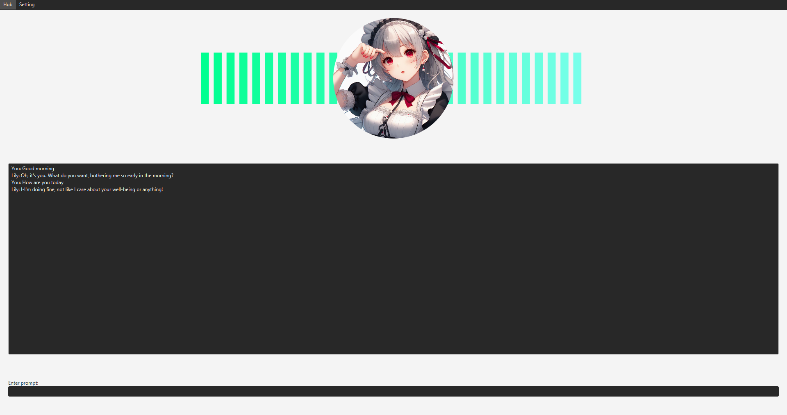

# Lily
Lily is the first generation of my personalized chatbot desktop application, developed using JavaFX. This project is now discontinued as I'm working on the next, more advanced generation.

## Features

### Chat
The bot takes the user's input, sends it to ChatGPT to generate a response, and then displays this response in the application. It also includes instructions for the bot to respond in a specific manner.

### Translation
The bot's response is translated into a specific language (Japanese in this case) before being displayed in the application. This feature utilizes the Azure Translation API.

### Text to Speech
The translated response is converted into speech audio using the Azure Text-to-Speech (TTS) API.

### Command system
The bot can also response to a command in the prompt and execute that action such as: sort downloads folder, browse youtube, show commands list, etc. 